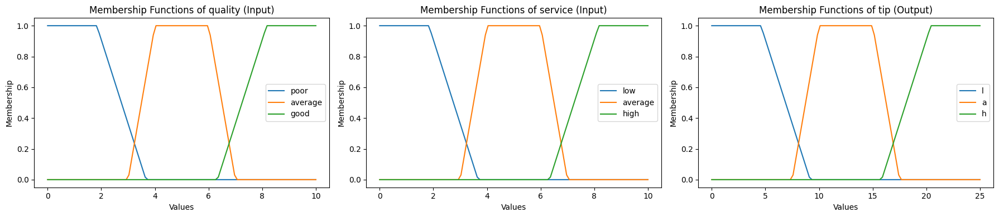
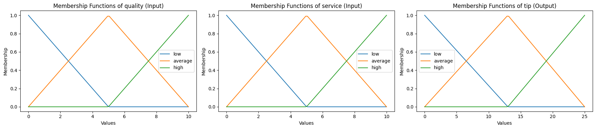
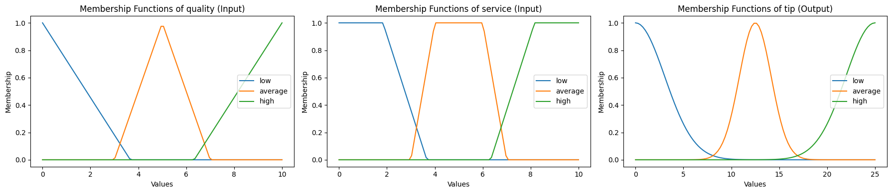

# FuzzyLite simple class implementation for Python

> I need to add more membership functions shapes but this is enough for a not complez inference system.

## Automatic Creation

Do you need some automatic variable creation? Well, it's simple, here a example using trapezoid membership functions.

```python
from FIS import *


# =======================================
# DECLARING PART
# =======================================
fis = FIS()
overlap = 0.1
quality = fis.create_input_variable(
    variable_name="quality",
    variable_minimum=0.0,
    variable_maximum=10.0,
    auto_mf_type="trapezoid",
    overlap=overlap,
    variable_labels=["poor", "average", "good"] # u can modify our custom labels
)
service = fis.create_input_variable(
    variable_name="service",
    variable_minimum=0.0,
    variable_maximum=10.0,
    auto_mf_type="trapezoid",
    overlap=overlap,
)
tip = fis.create_output_variable(
    variable_name="tip",
    variable_minimum=0.0,
    variable_maximum=25.0,
    auto_mf_type="trapezoid",
    variable_labels=["l", "a", "h"], # & use it even in automatic mf mode😎
    overlap=overlap,
)

fis.add_input_variable(quality)
fis.add_input_variable(service)
fis.add_output_variable(tip)


# =======================================
# CALCULATION PART
# =======================================
rules = [
    "if quality is poor then tip is l",
    "if service is low then tip is l",
    "if service is average then tip is a",
    "if service is high then tip is h",
    "if quality is good then tip is h",
]
fis.create_rule_block(rule_name="mamdami")
fis.add_rule_block()
fis.add_rules_from_list(rules)
fis.inference([6.5, 9.8])


# =======================================
# VISUALIZATION PART
# =======================================
print("Tip: {0}".format(fis.output)) # Tip: 21.43452380952381
fis.plot_all_variables()
```


The plot function gives us a pretty sight on what we are doing inside our FIS:




## Manual Creation

Maybe you need a certain term distribution and not doing it automatically? Well, let's see a example:

```python
from FIS import *


# =======================================
# DECLARING PART
# =======================================
fis = FIS()
overlap = 0.1 # in this case, it's not taken as terms are defined manually
quality = fis.create_input_variable(
    variable_name="quality",
    variable_minimum=0.0,
    variable_maximum=10.0,
    overlap=overlap,
    terms=[
        fl.Triangle("low", 0.0, 0.0, 5.0),
        fl.Triangle("average", 0.0, 5.0, 10.0),
        fl.Triangle("high", 5.0, 10.0, 10.0),
    ],
)
service = fis.create_input_variable(
    variable_name="service",
    variable_minimum=0.0,
    variable_maximum=10.0,
    overlap=overlap,
    terms=[
        fl.Triangle("low", 0.0, 0.0, 5.0),
        fl.Triangle("average", 0.0, 5.0, 10.0),
        fl.Triangle("high", 5.0, 10.0, 10.0),
    ],
)
tip = fis.create_output_variable(
    variable_name="tip",
    variable_minimum=0.0,
    variable_maximum=25.0,
    overlap=overlap,
    terms=[
        fl.Triangle("low", 0.0, 0.0, 13.0),
        fl.Triangle("average", 0.0, 13.0, 25.0),
        fl.Triangle("high", 13.0, 25.0, 25.0),
    ],
)
fis.add_input_variable(quality)
fis.add_input_variable(service)
fis.add_output_variable(tip)


# =======================================
# CALCULATION PART
# =======================================
rules = [
    "if quality is low then tip is low",
    "if service is low then tip is low",
    "if service is average then tip is average",
    "if service is high then tip is high",
    "if quality is high then tip is high",
]
fis.create_rule_block(rule_name="mamdami")
fis.add_rule_block()
fis.add_rules_from_list(rules)
fis.inference([6.5, 9.8])


# =======================================
# VISUALIZATION PART
# =======================================
print("Tip: {0}".format(fis.output)) # Tip: 20.452404809619242
fis.plot_all_variables()
```


The plot function gives us a pretty sight on what we are doing inside our FIS:



### Combining Functions

Now, a brief look when we combine the different shapes in memebership functions:

```python
from FIS import *


# =======================================
# DECLARING PART
# =======================================
fis = FIS()
overlap = 0.1
quality = fis.create_input_variable(
    variable_name="quality",
    variable_minimum=0.0,
    variable_maximum=10.0,
    overlap=overlap,
    auto_mf_type="triangular",
)
service = fis.create_input_variable(
    variable_name="service",
    variable_minimum=0.0,
    variable_maximum=10.0,
    overlap=overlap,
    auto_mf_type="trapezoid",
)
tip = fis.create_output_variable(
    variable_name="tip",
    variable_minimum=0.0,
    variable_maximum=25.0,
    overlap=overlap,
    auto_mf_type="gaussian",
)

fis.add_input_variable(quality)
fis.add_input_variable(service)
fis.add_output_variable(tip)


# =======================================
# CALCULATION PART
# =======================================
rules = [
    "if quality is low then tip is low",
    "if service is low then tip is low",
    "if service is average then tip is average",
    "if service is high then tip is high",
    "if quality is high then tip is high",
]
fis.create_rule_block(rule_name="mamdami")
fis.add_rule_block()
fis.add_rules_from_list(rules)
fis.inference([6.5, 9.8])


# =======================================
# VISUALIZATION PART
# =======================================
print("Tip: {0}".format(fis.output)) # Tip: 22.55929294090785
fis.plot_all_variables()
```

The plot function gives us a pretty sight on what we are doing inside our FIS:


